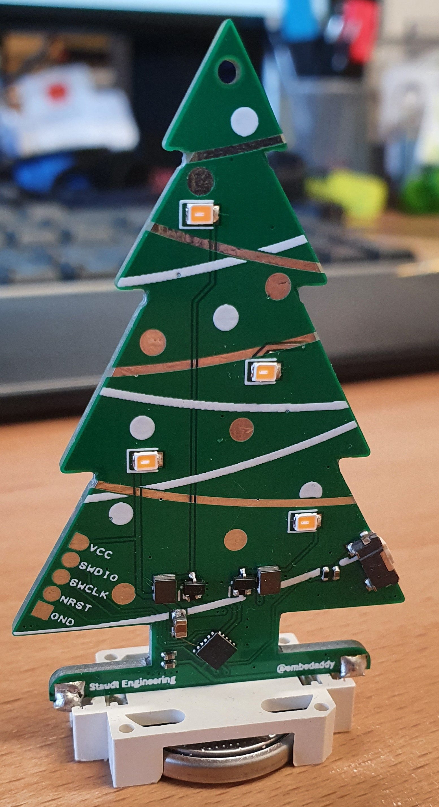

HHTronik / @embedaddy's EterniTree
==================================

An christmas-themed excursion into ultra-low power territory built around an STM32L011 and four software controlled 
"boost converters". Can run for over a year on a single (good quality) CR2032 cell in the lower brighness modes

Firmware
--------

The firmware to flash on the microcontroller can be found in the `/firmware` folder. 
Refer to [/firmware/README](./firmware/) for instruction regarding the setup of the development environment (STM32 Cube IDE) and programming.

LICENCE
-------

This hardware part of this project is licenced under CERN Open Hardware Licence Version 2 - Strongly Reciprocal see LICENCE file for the full text.

The firmware is released und GPL-v3 see LICENCE file in `/firmware` for the full text.